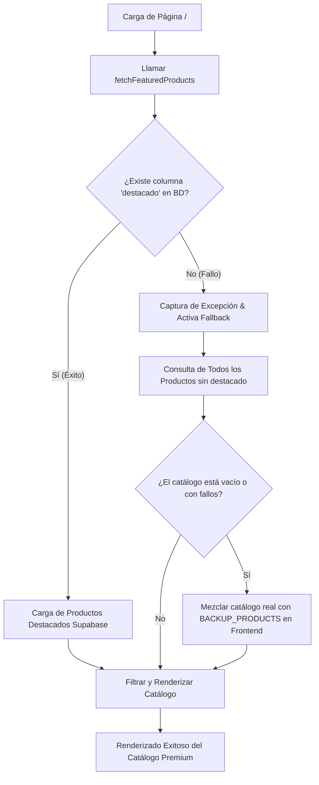

# 🎮 KRUSH Gaming Store — Premium E-Commerce Platform

[](https://nextjs.org/)
[](https://react.dev/)
[](https://supabase.com/)
[](https://tailwindcss.com/)
[](https://www.typescriptlang.org/)
[](https://www.postgresql.org/)
[](https://github.com/)

Bienvenido al repositorio central de **KRUSH Gaming Store**, un portal de e-commerce de videojuegos digitales de alto rendimiento. Esta plataforma ha sido diseñada con un enfoque inmersivo enfocado al sector gaming, emulando la estética moderna de tiendas de clase mundial como Steam y Epic Games Store.

El core del sistema combina una interfaz reactiva rápida y segura con un backend robusto basado en **Supabase**, preparado para soportar cargas dinámicas y gestionar de forma resiliente cualquier discrepancia en la base de datos de producción.

---

## 🎯 Objetivos de Ingeniería y UX

* **Alineación Visual Premium**: Interfaz totalmente oscura (`#020813`) con acentos de neón cian, efectos glassmorphism translúcidos, micro-animaciones en hover y animaciones de flotado 3D en el Hero Section.
* **Resiliencia de Datos de Producción**: Mecanismo de auto-recuperación ante cambios de esquema en bases de datos remotas sin interrumpir la experiencia de navegación del usuario.
* **Seguridad Gamer Activa**: Sincronización en tiempo real del estado de autenticación de Supabase Auth en la barra de navegación para una experiencia fluida al iniciar sesión.

---

## 🛠️ Arquitectura del Repositorio

El proyecto está estructurado como una solución modular de dos capas principales:

```bash
Krush/
├── FRONTEND/              # Aplicación Web Next.js (App Router, TS, Tailwind)
│   ├── public/            # Assets estáticos y banners premium generados
│   ├── src/
│   │   ├── app/           # Rutas principales de la aplicación (Home, Auth)
│   │   ├── components/    # Componentes modulares y reutilizables (Navbar, Hero, ProductCard)
│   │   └── lib/           # Clientes y configuraciones del SDK (Supabase Client)
│   ├── inspect-products.js# Herramientas internas de inspección de datos
│   └── package.json
└── BACKEND/               # Estructuras de bases de datos y scripts de backend (SQL)
```

---

## 🚀 Pila Tecnológica (Tech Stack)

| Capa | Tecnología | Propósito |
| :--- | :--- | :--- |
| **Framework Web** | `Next.js v16.2 (React 19)` | Renderizado ágil y navegación fluida por App Router con Turbopack. |
| **Estilos y UX** | `TailwindCSS v4.0` | Estructuras de diseño responsivas rápidas con variables nativas de neón. |
| **Backend & DB** | `Supabase` | Backend as a Service que implementa PostgreSQL relacional nativo. |
| **Seguridad** | `Supabase Auth` | Control de sesiones y autenticación segura con JWT y re-sincronización en tiempo real. |
| **Tipado** | `TypeScript` | Verificación de tipos estática en el 100% de los flujos de datos. |
| **Iconografía** | `Lucide React` | Paquete de iconos vectoriales consistentes y modernos. |

---

## ⚙️ Configuración y Despliegue Local

### Requisitos Previos
* **Node.js**: Versión `v20.0.0` o superior recomendada.
* **Supabase**: Una cuenta/proyecto activo en la nube de Supabase.

### 1. Preparación de la Base de Datos (Postgres)
Para inicializar la estructura de las tablas en Supabase, ejecuta las consultas SQL del script de configuración ubicado en `FRONTEND/supabase_setup.sql`. Esto creará automáticamente:
* La tabla `categorias` (Deportes, Acción, Aventura, etc.).
* La tabla `productos` con llaves foráneas y relaciones correctas.

### 2. Configuración de Variables de Entorno
Crea un archivo `.env.local` dentro del directorio `FRONTEND/` con las siguientes credenciales:
```env
NEXT_PUBLIC_SUPABASE_URL=tu_supabase_url_aqui
NEXT_PUBLIC_SUPABASE_ANON_KEY=tu_supabase_anon_key_aqui
```

### 3. Instalación e Inicio de Desarrollo
Ejecuta las siguientes instrucciones en tu terminal:

```bash
# Navegar al directorio Frontend
cd FRONTEND

# Instalar dependencias del proyecto
npm install

# Iniciar servidor de desarrollo con Turbopack
npm run dev
```
La aplicación estará disponible de inmediato en `http://localhost:3000`.

---

## 🛡️ Patrón de Diseño Resiliente (Mecanismo Fallback)

Como líderes de desarrollo, valoramos la tolerancia a fallos. Si en la base de datos de producción falta la columna de destacados (`destacado`) o el control de inventario (`stock`), la aplicación no crasheará gracias a nuestro flujo de contingencia:



### Gestión de Portadas Premium (Zero Gaps)
En el frontend, las imágenes nulas de la base de datos son resueltas mediante un mapeador inteligente en [ProductCard.tsx](file:///c:/Users/emanu/Desktop/Krush/Krush/FRONTEND/src/components/ProductCard.tsx), el cual asocia portadas de alta definición de Unsplash específicas a títulos conocidos como *FIFA 23*, *Red Dead Redemption 2*, *Zelda*, *Hollow Knight*, entre otros.

---

## 🛡️ Estándares de Código y Control de Calidad

* **Tipado Estricto**: Todo cambio debe compilar limpiamente bajo `npx tsc --noEmit` sin arrojar advertencias del compilador.
* **Consistencia de Estilos**: Uso estricto del sistema de diseño oscuro y cyan neón (`bg-cyan-400 hover:bg-cyan-300 shadow-[0_0_15px_rgba(34,211,238,0.4)]`).
* **Pruebas de Autenticación**: Validar que la sincronización en tiempo real mediante `supabase.auth.onAuthStateChange` alterne el perfil de usuario en la barra de navegación de forma inmediata tras el inicio/cierre de sesión.

---

Desarrollado con pasión para **KRUSH Gaming Store**. 🚀
